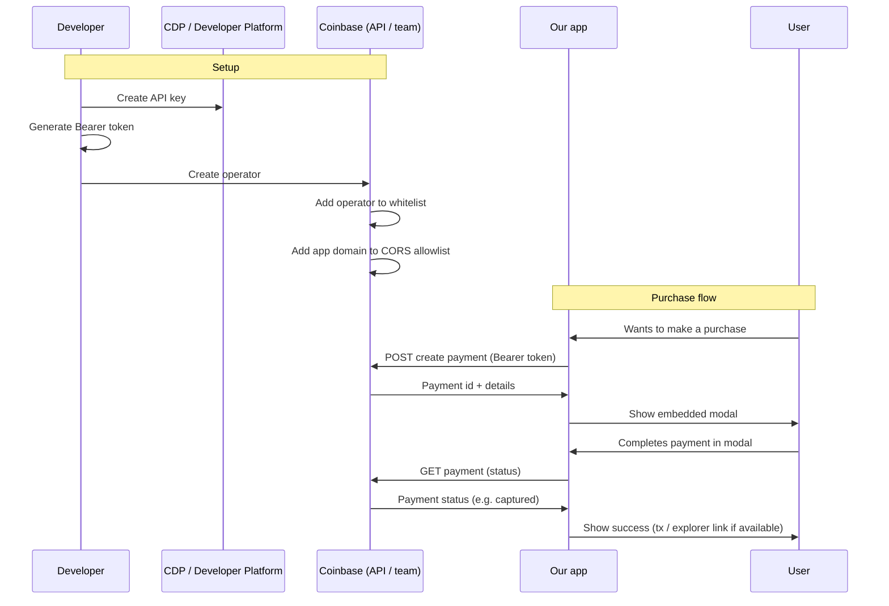
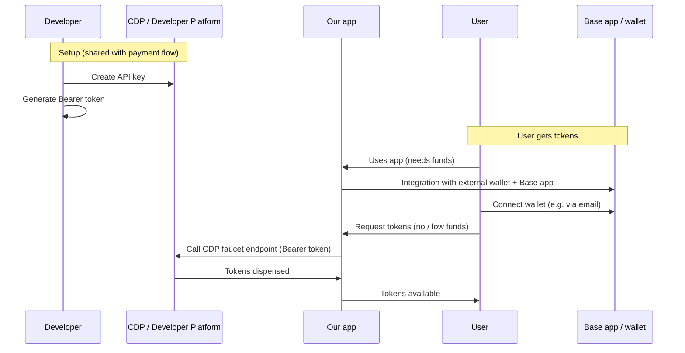
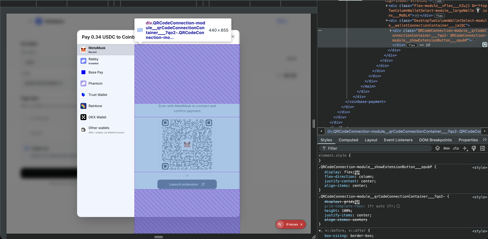

# Feedback: Coinbase Payments API (CDP) 

*Feedback document for Coinbase's technical team, based on implementing two main flows: payments (create payment → embedded modal → capture → success) and faucet (wallet/Base integration → request tokens via CDP).*

---

## Summary

We integrated two main flows with the CDP API: **payments** (create payment, embedded modal, capture, success) and **faucet** (external wallet + Base app integration, user connects and can request tokens via the CDP endpoint). The overall integration is workable and both flows can be completed end to end. Below is what worked well, the issues we ran into by step, and improvement suggestions.

### Payment flow (sequence)

### Faucet flow (sequence)

---

## What Worked Well

- **Authentication (API key and Bearer token)**  
  Creating the API key in CDP, generating the Bearer token, and including it in requests is clear and worked without issues.

- **Support**  
  The operator whitelist process was resolved quickly with Coinbase's team.

- **Create Payment documentation**  
  The `autoCapture` and `autoAuthorize` parameters that were missing from the docs are now documented; the create payment docs match current behaviour.

- **End-to-end flow (payments)**  
  The full flow—create payment → show embedded modal → capture → success screen—can be completed by following the guide.

- **Faucet flow**  
  Auth (API key, Bearer token) and calling the CDP faucet endpoint work as expected. Integration with the external wallet and Base app is straightforward; the user can connect and, when they have no or low funds, request tokens via our app calling the CDP endpoint.

---

## Issues and Gaps by Step

### Faucet flow

- **Wallet connect vs email**  
  The Base app does not support direct wallet connect in our integration, but it works well using email (e.g. user signs in / connects via email). Documenting supported connection methods (wallet connect, email, etc.) per environment would help set expectations.

### Create operator and whitelist

- **Whitelist process not documented**  
  How to request or complete the operator whitelist process is not documented. It would help to have this explained (and, if applicable, a list of related error codes) so we know what to do when something fails at this step.

### Create Payment (POST)

- *(Resolved)*  
  Initially `autoCapture` and `autoAuthorize` were missing from the docs; the documentation is now up to date.

### Embedded modal

- **CSS customisation**  
  Styling is limited to colours. It would be useful to be able to override the modal container classes as well, not only colours, to better match our app. In particular, it is difficult to remove padding or overwrite internal classes (e.g. to align the modal with our layout). Example:

   

- **Connect wallet + payment in one flow**  
  It would be useful to support connecting the wallet together with (or before) the payment step. In flows like our faucet, we cannot know which wallet the user will pay with until the modal opens at the last step, which limits what we can do earlier in the journey (e.g. pre-checks, messaging, or UX that depends on the chosen wallet). Being able to surface connect-wallet earlier with the same modal would help.

### CORS and domains

- **CORS not documented**  
  We hit CORS issues when using the modal from our domain, and there is no documentation on how to resolve them (e.g. which domains to register, what Coinbase needs to configure).
- **Environments section missing**  
  A sandbox environment exists but is not mentioned in the docs. A dedicated "Environments" section would help, with:
  - Description of production vs sandbox.
  - Base API URLs for each environment.
- **Local testing**  
  There is no documented way to test the flow locally. It would help to be able to use sandbox with an option (or mode) that skips CORS checks for local development.

### Get payment and success

- **GET payment not covered in the flow**  
  We used the GET payment endpoint following the POST guide, but there is no section describing the GET endpoint: response types and example payloads.
- **Post-capture transaction info**  
  After capture, the transaction hash (tx) is not returned so we can show the user a link to the blockchain explorer. Documenting how to obtain and display that link would be very useful.

### General documentation

- **Missing steps**  
  In some parts of the flow, intermediate steps or clarifications are missing to follow the guide from start to finish without guessing.

---

## Suggestions (Nice to Have)

- **Error code reference**  
  A list of error codes per endpoint or flow (auth, operators, payments, CORS, etc.) to debug more quickly.

- **Payments architecture overview**  
  A section explaining the overall payments architecture: the role of each part (payments, operators, webhooks, champions, rewards) and how they relate.

- **Business-oriented intro**  
  A higher-level intro section with diagrams and different usage options (e.g. auto-capture vs keeping funds in escrow) to make it easier to choose how to integrate for each use case.

- **Payment & Connect Wallet as SDK**  
  Offer payment and connect-wallet flows as a proper SDK (instead of or in addition to embedded code), so integrators get a more flexible, parameterizable, and maintainable integration.
